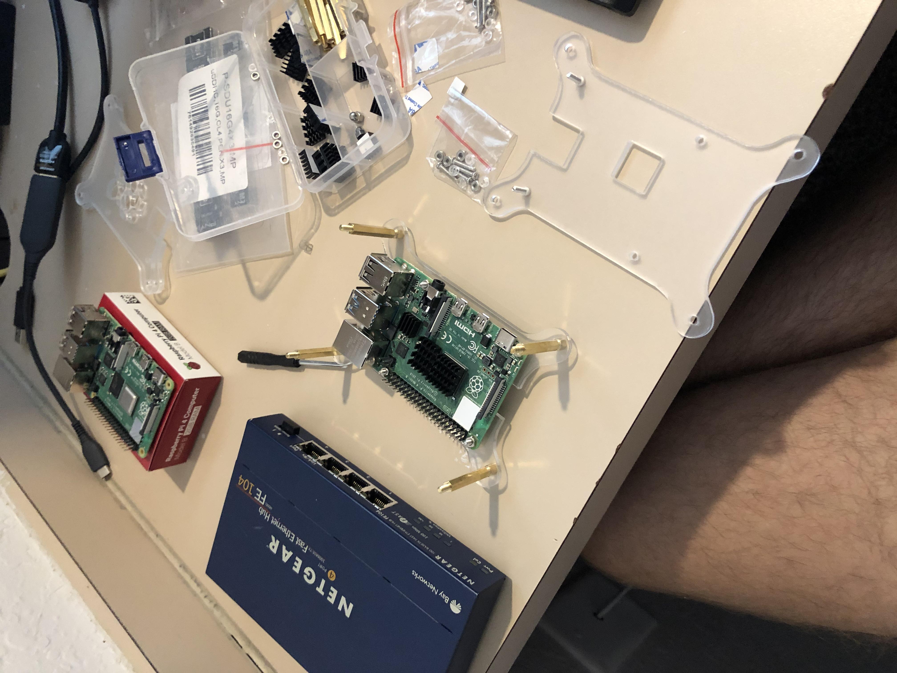

# raspberry-pi-4-spark-cluster
Project that details the creation of a Spark Cluster using Raspberry Pi 4 and Ubuntu Server LTS 20.04

## Introduction

## Physical Cluster Setup
1. Pi/Server Rack

To start the setup, install your Raspberry Pis on the server rack casing. You can find these cases for cheap on Amazon.

2. 

## Individual Raspberry Pi Setup

## Cluster Setup

## Hadoop Installation

## Spark Installation
