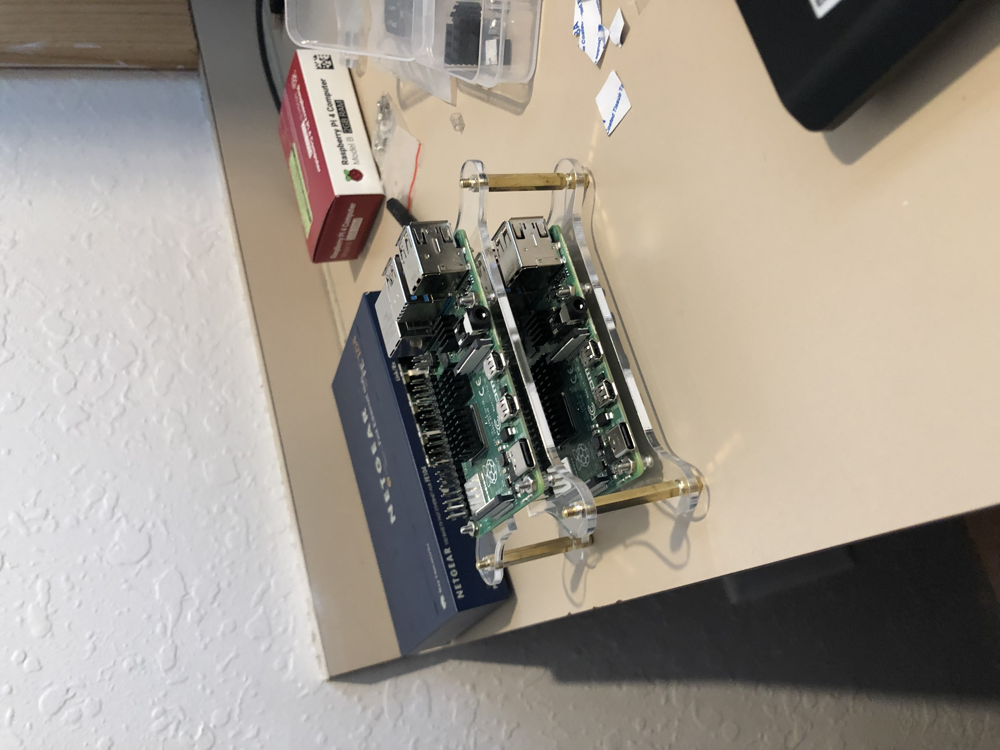
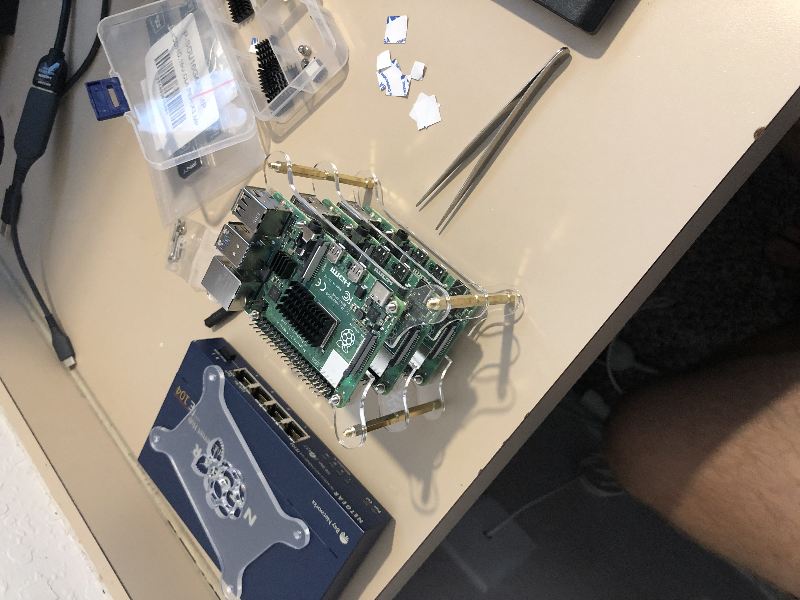
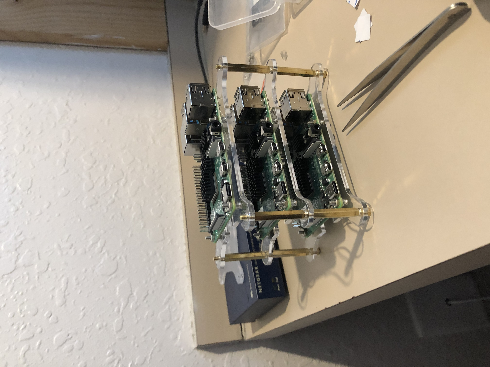
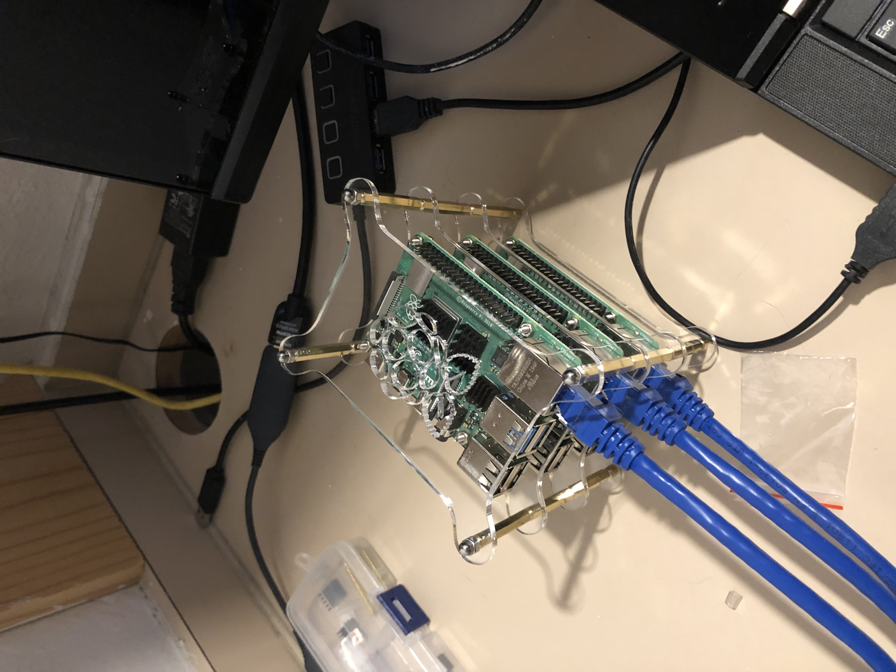
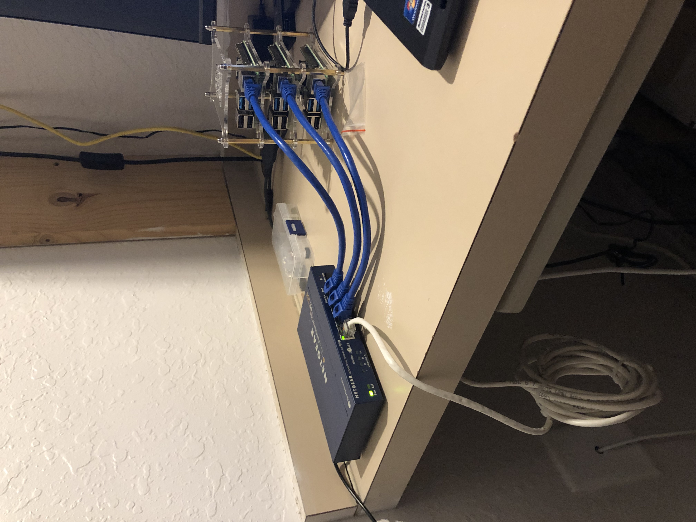
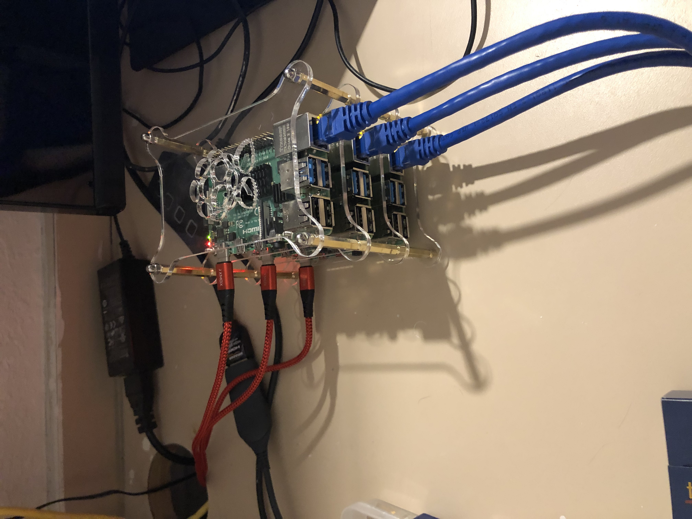
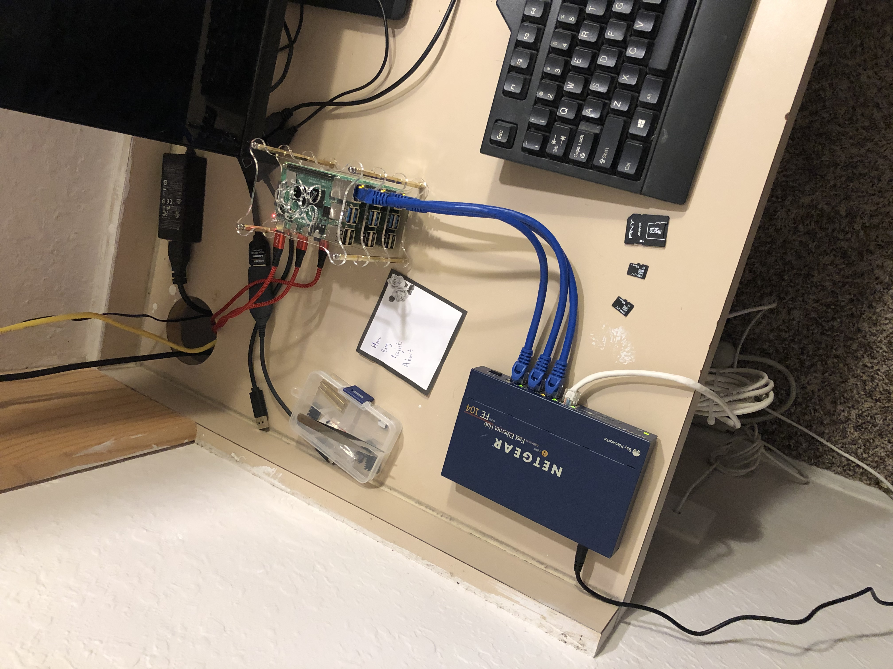

# raspberry-pi-4-spark-cluster
Project that details the creation of a Spark Cluster using Raspberry Pi 4 and Ubuntu Server LTS 20.04

## Introduction
This is currently a WIP. 

Tasks

- [X] Physical Cluster Setup (Power Supply and Network Architecture)
- [X] Individual Pi Setup (Ubuntu Server LTS 20.04 Installation)
- [X] Cluster Setup (Public Key SSH Authentication, Static IP, Host/Hostnames Configuration)
- [X] Hadoop Installation (Single Node and Multi-Node; Hadoop 3.2.1)
- [X] Spark Installation
- [ ] Commit Spark Installation Files to Repository
- [ ] Data Processing in Spark
- [ ] Revise/Edit

### Sources

My setup would not have been possible without knowledge from the following articles:

- [A Data Science/Big Data Laboratory by Pier Taranti](https://towardsdatascience.com/assembling-a-personal-data-science-big-data-laboratory-in-a-raspberry-pi-4-or-vms-cluster-e4c5a0473025)
- [Build Raspberry Pi Hadoop/Spark Cluster from Scratch by Henry Liang](https://medium.com/analytics-vidhya/build-raspberry-pi-hadoop-spark-cluster-from-scratch-c2fa056138e0)
- [How to Install and Set Up a 3-Node Hadoop Cluster by Linode (Contributitons from Florent Houbart)](https://www.linode.com/docs/databases/hadoop/how-to-install-and-set-up-hadoop-cluster/)
- [Install, Configure, and Run Spark on Top of a Hadoop YARN Cluster](https://www.linode.com/docs/databases/hadoop/install-configure-run-spark-on-top-of-hadoop-yarn-cluster/)
- [Apache Hadoop Documentation](https://hadoop.apache.org/docs/stable/index.html)
- [Apache Spark Documentation](https://spark.apache.org/docs/latest/)

Without further ado, let's get on to it!

## Physical Cluster Setup
### 1. Server Rack

To start the setup, install your Raspberry Pis on the server rack casing. You can find these cases for cheap on Amazon.

<p float="left">
  
   
  
</p>

### 2. Network Connection

For my setup, I used a wired ethernet connection from my router which was then routed to my Netgear 4-port 100 Mbps Switch. Then, I connected each Raspberry Pi to the switch via a 1-foot ethernet cable.

<p float="left">
  
   
  
</p>

### 3. Power Supply

I used a [RAVPower 4-Port USB Power Supply](https://www.amazon.com/Charging-Station-RAVPower-Charger-Compatible/dp/B00OT6YUIY/ref=sr_1_4?dchild=1&keywords=ravpower+4+port&qid=1597074773&sr=8-4) to power my Raspberry Pi. As they are Raspberry Pi 4s, they all use USB-C as a power supply.

<p float="left">
  
   
  
</p>

## Individual Raspberry Pi Setup

### 1. Ubuntu Server LTS 20.04 Installation

Use the [Raspberry Pi Imager](https://ubuntu.com/tutorials/how-to-install-ubuntu-on-your-raspberry-pi#2-prepare-the-sd-card) to write the Ubuntu Server LTS 20.04 64 Bit to each pi.

<p float="left">
  
</p>

### 2. Pi Configuration

In this stage, we'll SSH into each Pi and setup some basic configuration. 

**Repeat the following steps for each Pi.**

Plug in one Pi at a time; finish the setup configuration completely before moving on to the next Pi.

Use this net-tools command to find the IP address of the Pi.

```bash
$ arp -na | grep -i "dc:a6:32"
```

If that doesn't return anything, you can also use your router admin interface to see a list of connected devices. 

The name of the device should be `ubuntu`

After you're connected you'll be prompted to change the password. Make the password the same on each Pi; something secure but easy to remember. 

Ensure that the Pi has the time synchronized using the following command:

```bash
$ timedatectl status
```

You should be returned this prompt:

```
               Local time: Mon 2020-08-10 12:24:54 EDT  
           Universal time: Mon 2020-08-10 16:24:54 UTC  
                 RTC time: Mon 2020-08-10 16:24:54      
                Time zone: America/New_York (EDT, -0400)
System clock synchronized: yes                          
              NTP service: active                       
          RTC in local TZ: no          
```

If the system clock is synchronized and NTP service is active, you're good to go. 

Lastly, run the following commands to finish individual configuration:

```bash
$ sudo apt update
$ sudo apt upgrade
$ sudo reboot
```

If you get a cache lock error after the update command, reboot the Pi try again.

## Cluster Setup

In this stage, we'll setup static IPs, hosts/hostname, public-key SSH authentication, and ease-of-use functions.

### 1. Static IP Setup

**The following steps will need to be done on each Pi.**

Ubuntu Server LTS 20.04 requires Netplan for network configuration. Specifically, editing a few yaml files.

First, SSH into the Pi and find the name of your network interface by running:

```bash
$ ip a
```

The returned information should look like so:

<pre>
1: lo: <LOOPBACK,UP,LOWER_UP> mtu 65536 qdisc noqueue state UNKNOWN group default qlen 1000
    link/loopback 00:00:00:00:00:00 brd 00:00:00:00:00:00
    inet 127.0.0.1/8 scope host lo
       valid_lft forever preferred_lft forever
    inet6 ::1/128 scope host 
       valid_lft forever preferred_lft forever
2: <b>eth0</b>: <BROADCAST,MULTICAST,UP,LOWER_UP> mtu 1500 qdisc fq_codel state UP group default qlen 1000
    link/ether 7c:97:0d:a6:27:53 brd ff:ff:ff:ff:ff:ff
    inet 192.168.1.1/24 brd 192.168.0.255 scope global dynamic noprefixroute en
...
</pre>

The network interface name is the bolded `eth0` tag (It will not be bolded on your system, but this is the location you should look). 
Keep this in mind, we'll need this for the network configuration file.

Next, you'll need to use nano or vim to edit the configuration files. In this tutorial, I'll be using nano. 
Use the following commands to edit the configuration file to disable automatic network configuration.

```bash
$ sudo nano /etc/cloud/cloud.cfg.d/99-disable-config.cfg
```

All you need to add is the following code:

```cfg
network: {config: disabled}
```

Then, you'll setup the static IP by editing the 50-cloud-init.yaml file. Use the following command:

```bash
$ sudo nano /etc/netplan/50-cloud-init.yaml
```

The basic template to set a static IP is:

```yaml
network:
    ethernets:
        {Network Interface Name}:
            dhcp4: false
            addresses: [{Specifc IP Adress}/24]
            gateway4: {Gateway Address}
            nameservers:
                addresses: [{Gateway Address}, 8.8.8.8]
    version: 2
```

My configuration file looked like so:
(X being the last digit of the specific IP address for each Pi; 10.1.2.121, 10.1.2.122, 10.1.2.123, etc.)

```yaml
network:
    ethernets:
        eth0:
            dhcp4: false
            addresses: [10.1.2.X/24]
            gateway4: 10.1.2.1
            nameservers:
                addresses: [10.1.2.1, 8.8.8.8]
    version: 2
```

After editing the file, apply the settings by using the following commands:

```bash
$ sudo netplan apply
```
`sudo netplan apply` will make your SSH session hang because the ip address changes. 
Kill the terminal session and SSH into the Pi using the new ip address.

Then reboot the Pi and confirm the static IP address is set correctly.

### 2. Hosts/Hostname Configuration

**The following steps will need to be done on each Pi.**

Now it's time to configure the hosts and hostnames files to the specific Pi information.

First we'll SSH into the Pi and update the hostname file using the following command:

```bash
$ sudo nano /etc/hostname
```

The hostname file should like so (X being the last digit of the specific IP address for each Pi):

```
pi0X
```

For example, the hostname file for pi01 will look like:

```
pi01
```

Next, we'll have to update the hosts file using the following command:

```bash
$ sudo nano /etc/hosts
```

The hosts file should look like so after editing:

```
# The following lines are desirable for IPv6 capable hosts
::1 ip6-localhost ip6-loopback
fe00::0 ip6-localnet
ff00::0 ip6-mcastprefix
ff02::1 ip6-allnodes
ff02::2 ip6-allrouters
ff02::3 ip6-allhosts

10.1.2.121 pi01
10.1.2.122 pi02
10.1.2.123 pi03
```

While editing the hosts file, make sure to delete the localhost 127.0.0.1 line from the file.

The template for adding additional nodes to the hosts file is:

```
{IP Address} {hostname}
```

Note, the hostname file will be different for each node, but the hosts file should be exactly the same.

Now reboot the Pi and move on to the next Pi until all are configured. 

### 3. Public Key SSH Authentication Configuration

**Perform these steps on the master Pi until only until directed to do otherwise.**

First, edit the ssh config file on the Pi using the following command:

```bash
$ nano ~/.ssh/config
```

Add all of the nodes to the config file, including the Host, User, and Hostname for each Pi.

The template for adding nodes to the config file is:

```
Host piXX
User ubuntu
Hostname {IP Address}
```

My config file looked like this after adding all of my nodes to the file: 

```
Host pi01
User ubuntu
Hostname 10.1.2.121

Host pi02
User ubuntu
Hostname 10.1.2.122

Host pi03
User ubuntu
Hostname 10.1.2.123
```

Next, create an SSH key pair on the Pi using:

```bash
$ ssh-keygen -t rsa -b 4096
```

You'll be prompted to select a directory to save and for a passphrase.

Press enter through the prompts because the key pair needs to be saved in the .ssh directory and the key pair should be passwordless.

The output should look similar to this:

```
Your identification has been saved in /your_home/.ssh/id_rsa
Your public key has been saved in /your_home/.ssh/id_rsa.pub
The key fingerprint is:
SHA256:/hk7MJ5n5aiqdfTVUZr+2Qt+qCiS7BIm5Iv0dxrc3ks user@host
The key's randomart image is:
+---[RSA 4096]----+
|                .|
|               + |
|              +  |
| .           o . |
|o       S   . o  |
| + o. .oo. ..  .o|
|o = oooooEo+ ...o|
|.. o *o+=.*+o....|
|    =+=ooB=o.... |
+----[SHA256]-----+
```

Repeat the SSH keygen on Pi 2 and 3.

Then use the following command on all Pis to copy the public keys into Pi 1's authorized key list:

```bash
$ ssh-copy-id piXX
```

XX stands for the specific digit identifier for the Pi (pi01, pi02, pi03)

Finally, you can copy Pi 1's configuration files to the rest of the Pi's using the following commands:

```bash
$ scp ~/.ssh/authorized_keys piXX:~/.ssh/authorized_keys
```

```bash
$ scp ~/.ssh/config piXX:~/.ssh/config
```

Now you should be able to ssh into any Pi from any of the Pis without providing a password.

Make sure to test it out from all Pis to ensure everything is working properly.


### 4. Cluster Ease of Use Functions

This step entails editing the `.bashrc` file in order to create some custom functions for ease of use. 

On the master Pi, we'll first edit the ~/.bashrc file:

```bash
$ nano ~/.bashrc
```

Within this file, add the following code to the bottom of the file:

```bash
# cluster management functions

#   list what other nodes are in the cluster
function cluster-other-nodes {
    grep "pi" /etc/hosts | awk '{print $2}' | grep -v $(hostname)
}

#   execute a command on all nodes in the cluster
function cluster-cmd {
    for node in $(cluster-other-nodes);
    do
        echo $node;
        ssh $node "$@";
    done
    cat /etc/hostname; $@
}

#   reboot all nodes in the cluster
function cluster-reboot {
    cluster-cmd sudo reboot now
}

#   shutdown all nodes in the cluster
function cluster-shutdown {
    cluster-cmd sudo shutdown now
}

function cluster-scp {
    for node in $(cluster-other-nodes);
    do
        echo "${node} copying...";
        cat $1 | ssh $node "sudo tee $1" > /dev/null 2>&1;
    done
    echo 'all files copied successfully'
}

#   start yarn and dfs on cluster
function cluster-start-hadoop {
    start-dfs.sh; start-yarn.sh
}

#   stop yarn and dfs on cluster
function cluster-stop-hadoop {
    stop-dfs.sh; stop-yarn.sh
}
```

Now use the following command to copy the .bashrc to all the worker nodes:

```bash
cluster-scp ~/.bashrc
```

Lastly, run the following command to source the .bashrc file on all nodes:

```bash
cluster-cmd source ~/.bashrc
```
You now have a functioning cluster computer. In order to start running parallel processing tasks, we'll have to install Hadoop and then Spark.

## Hadoop 3.2.1 Installation

### 1. Install Java 8

To install Java 8 on each node, use the following command:

```bash
$ cluster-cmd sudo apt install openjdk-8-jdk
```

### 2. Hadoop Single Node Installation

#### Download Hadoop
Next, download the Hadoop 3.2.1 binary onto your machine. You can get the binary from the [Apache Hadoop website](https://hadoop.apache.org/releases.html) and use wget to download it on to the Pi.

```bash
$ wget https://downloads.apache.org/hadoop/common/hadoop-3.2.1/hadoop-3.2.1.tar.gz
```

Next, extract the tar and move the binary to the /opt directory using the following command:

```bash
$ sudo tar -xvf hadoop-3.2.1.tar.gz -C /opt/
```
Then, cd into /opt/.

```bash
$ cd /opt
```

Change the name of the directory in /opt from hadoop-3.2.1 to hadoop:

```bash
$ sudo mv hadoop-3.2.1 hadoop
```

Change the permissions on the directory.

```bash
$ sudo chown ubuntu:ubutnu -R /opt/hadoop
```
#### Setup .bashrc and hadoop-env.sh Environment Variables

Edit the `.bashrc` file to include the following environmental variables at the bottom of the file.

```bash
# path and options for java
export JAVA_HOME=/usr/lib/jvm/java-8-openjdk-arm64

# path and options for Hadoop
export HADOOP_HOME=/opt/hadoop
export PATH=$PATH:$HADOOP_HOME/bin:$HADOOP_HOME/sbin

export HADOOP_INSTALL=$HADOOP_HOME
export HADOOP_MAPRED_HOME=$HADOOP_HOME
export HADOOP_COMMON_HOME=$HADOOP_HOME
export HADOOP_HDFS_HOME=$HADOOP_HOME
export HADOOP_INSTALL=$HADOOP_HOME
export YARN_HOME=$HADOOP_HOME
export HADOOP_COMMON_LIB_NATIVE_DIR=$HADOOP_HOME/lib/native
export HADOOP_CONF_DIR=$HADOOP_HOME/etc/hadoop
export HADOOP_OPTS="-Djava.library.path=$HADOOP_HOME/lib/native"
```

Next, set the value of `JAVA_HOME` in /opt/hadoop/etc/hadoop/hadoop-env.sh. You'll have to scroll down to find the correct line. It should look like this:

```bash
...
# The java implementation to use. By default, this environment
# variable is REQUIRED on ALL platforms except OS X!
export JAVA_HOME=/usr/lib/jvm/java-8-openjdk-arm64
...
```

#### Setup the core-site.xml and hdfs-site.xml

Use the following command to edit the core-site.xml file.

```bash
$ sudo nano /opt/hadoop/etc/hadoop/core-site.xml
```

It should look like so after editing:

```xml
<configuration>
    <property>
        <name>fs.defaultFS</name>
        <value>hdfs://pi01:9000</value>
    </property>
</configuration>
```

Then edit the hdfs-site.xml file:
```bash
$ sudo nano /opt/hadoop/etc/hadoop/hdfs-site.xml
```

After editing:

```xml
<configuration>
    <property>
        <name>dfs.replication</name>
        <value>1</value>
    </property>
</configuration>
```

#### Test MapReduce

Format the NameNode (THIS WILL DELETE ALL DATA IN THE HDFS!):

```bash
$ hdfs namenode -format
```

Start the NameNode and DataNode:

```bash
$ start-dfs.sh
```

Make the required directories to run MapReduce jobs:

```bash
$ hdfs dfs -mkdir /user
$ hdfs dfs -mkdir /user/{username}
```

Copy input files into the distributed filesystem:

```bash
$ hdfs dfs -mkdir input
$ hdfs dfs -put /opt/hadoop/etc/hadoop/*.xml input
```

Run the test example:

```bash
$ hadoop jar /opt/hadoop/share/hadoop/mapreduce/hadoop-mapreduce-examples-3.2.1.jar grep input output 'dfs[a-z.]+'
```

View the ouput on the distributed file system:

```bash
$ hdfs dfs -cat output/*
```

When done, stop the NameNode and DataNode:
```bash
$ stop-dfs.sh
```

#### Test YARN

Configure the following parameters in the configuration files:

/opt/hadoop/etc/hadoop/mapred-site.xml:

```xml
<configuration>
    <property>
        <name>mapreduce.framework.name</name>
        <value>yarn</value>
    </property>
    <property>
        <name>mapreduce.application.classpath</name>
        <value>$HADOOP_MAPRED_HOME/share/hadoop/mapreduce/*:$HADOOP_MAPRED_HOME/share/hadoop/mapreduce/lib/*</value>
    </property>
</configuration>
```

/opt/hadoop/etc/hadoop/yarn-site.xml:

```xml
<configuration>
    <property>
        <name>yarn.nodemanager.aux-services</name>
        <value>mapreduce_shuffle</value>
    </property>
    <property>
        <name>yarn.nodemanager.env-whitelist</name>
        <value>JAVA_HOME,HADOOP_COMMON_HOME,HADOOP_HDFS_HOME,HADOOP_CONF_DIR,CLASSPATH_PREPEND_DISTCACHE,HADOOP_YARN_HOME,HADOOP_MAPRED_HOME</value>
    </property>
</configuration>
```

Start ResourceManager and NodeManager:

```bash
$ start-yarn.sh
```

Start NameNode and DataNode:

```bash
$ start-dfs.sh
```

Test if all daemons are running:

```bash
$ jps
```

Stop all daemons:

```bash
$ stop-yarn.sh
$ stop-dfs.sh
```

### 3. Hadoop Multi-Node Installation

#### Edit Site Configuration Files

Update the following configuration files:

/opt/hadoop/etc/hadoop/core-site.xml:

```xml
<?xml version="1.0" encoding="UTF-8"?>
<?xml-stylesheet type="text/xsl" href="configuration.xsl"?>
    <configuration>
        <property>
            <name>fs.default.name</name>
            <value>hdfs://pi01:9000</value>
        </property>
    </configuration>
```

/opt/hadoop/etc/hadoop/hdfs-site.xml:

```xml
<configuration>
    <property>
            <name>dfs.namenode.name.dir</name>
            <value>/opt/hadoop/data/nameNode</value>
    </property>

    <property>
            <name>dfs.datanode.data.dir</name>
            <value>/opt/hadoop/data/dataNode</value>
    </property>
    <property>
        <name>dfs.namenode.checkpoint.dir</name>
        <value>/opt/hadoop/hdfs/namenodesecondary</value>
    </property>
    <property>
            <name>dfs.replication</name>
            <value>1</value>
    </property>
</configuration>
```

/opt/hadoop/etc/hadoop/mapred-site.xml:

```xml
<configuration>
    <property>
        <name>mapreduce.framework.name</name>
        <value>yarn</value>
    </property>
    <property>
        <name>yarn.app.mapreduce.am.env</name>
        <value>HADOOP_MAPRED_HOME=$HADOOP_HOME</value>
    </property>
    <property>
        <name>mapreduce.map.env</name>
        <value>HADOOP_MAPRED_HOME=$HADOOP_HOME</value>
    </property>   
    <property>
        <name>mapreduce.reduce.env</name>
        <value>HADOOP_MAPRED_HOME=$HADOOP_HOME</value>
    </property>
    <property>
        <name>yarn.app.mapreduce.am.resource.memory-mb</name>
        <value>512</value>
    </property>
    <property>
        <name>mapreduce.map.resource.memory-mb</name>
        <value>256</value>
    </property>
    <property>
        <name>mapreduce.reduce.resource.memory-mb</name>
        <value>256</value>
    </property>
</configuration>
```

/opt/hadoop/etc/hadoop/yarn-site.xml:

```xml
<configuration>
    <property>
        <name>yarn.acl.enable</name>
        <value>0</value>
    </property>
    <property>
        <name>yarn.resourcemanager.hostname</name>
        <value>pi01</value>
    </property>
    <property>
        <name>yarn.nodemanager.aux-services</name>
        <value>mapreduce_shuffle</value>
    </property>
    <property>
        <name>yarn.nodemanager.resource.memory-mb</name>
        <value>1536</value>
    </property>
    <property>
        <name>yarn.scheduler.maximum-allocation-mb</name>
        <value>1536</value>
    </property>
    <property>
        <name>yarn.scheduler.minimum-allocation-mb</name>
        <value>128</value>
    </property>
    <property>
        <name>yarn.nodemanager.vmem-check-enabled</name>
        <value>false</value>
    </property>
</configuration>
```

#### Set the Master and Workers

For the Master:

```bash
$ nano /opt/hadoop/etc/hadoop/master
```

It should look like this:

```
pi01
```

For the Workers:

```bash
$ nano /opt/hadoop/etc/hadoop/workers
```

It should look like this:

```
pi02
pi03
```

#### Copy Hadoop Configuration to the rest of Nodes

Use the following command to copy all files from the master node to the worker nodes:

```bash
$ for pi in $(cluster-other-nodes); do rsync -avxP /opt/hadoop $pi:/opt; done
```

After everything is copied, you can verify that Hadoop was installed correctly using:

```bash
$ cluster-cmd hadoop version | grep Hadoop
```

#### Format the HDFS

To run for the first time, the HDFS needs to be formatted:

```bash
$ hdfs namenode -format
```

#### Run HDFS and YARN

To start the HDFS, run the following command on the master node:

```bash
$ start-dfs.sh
```

To start Yarn, run the following command:

```bash
$ start-yarn.sh
```

Ensure that everything is working by running the following command on all nodes:

```bash
$ jps
```

On the master node, `jps` should return:

```
Jps
NameNode
SecondaryNameNode
ResourceManager
```

On the worker nodes, `jps` should return:

```
Jps
DataNode
NodeManager
```

Congragulations! You now have a working YARN cluster!

## Spark Installation

### 1. Download Apache Spark
First, download the Spark 3.0.0 (pre-built for Hadoop 3.2 and later) binary onto your machine. You can get the binary from the [Apache Spark website](https://spark.apache.org/downloads.html) and use wget to download it on to the Pi.

```bash
$ wget https://downloads.apache.org/spark/spark-3.0.0/spark-3.0.0-bin-hadoop3.2.tgz
```

Next, extract the tar and move the binary to the /opt directory using the following command:

```bash
$ sudo tar -xvf spark-3.0.0-bin-hadoop3.2.tgz -C /opt/
```

Then, cd into /opt/.

```bash
$ cd /opt
```

Change the name of the directory in /opt to spark:

```bash
$ sudo mv spark-3.0.0-bin-hadoop3.2 spark
```

Change the permissions on the directory.

```bash
$ sudo chown ubuntu:ubutnu -R /opt/spark
```

### 2. Configure YARN for Spark Integration

Add the Spark directory to the PATH:

```bash
nano /opt/hadoop/.profile
```

Add the following line:

```
PATH=/opt/spark/bin:$PATH
```

Now, edit the Hadoop profile again:

```bash
nano /opt/hadoop/.profile
```

Add the following code:

```
export HADOOP_CONF_DIR=/opt/hadoop/etc/hadoop
export SPARK_HOME=/opt/spark
export LD_LIBRARY_PATH=/opt/hadoop/lib/native:$LD_LIBRARY_PATH
```

Reboot the Pi

```bash
sudo reboot

```
Rename the spark default template config file:

```bash
mv /opt/spark/conf/spark-defaults.conf.template /opt/spark/conf/spark-defaults.conf

```

Edit $SPARK_HOME/conf/spark-defaults.conf and set spark.master to yarn:

```bash
nano SPARK_HOME/conf/spark-defaults.conf
```

Set the following configurations:
```
spark.master yarn

spark.driver.memory 512m

spark.yarn.am.memory 512m

spark.executor.memory 512m
```

Congratulations, you now have a working Spark Cluster Computer!
