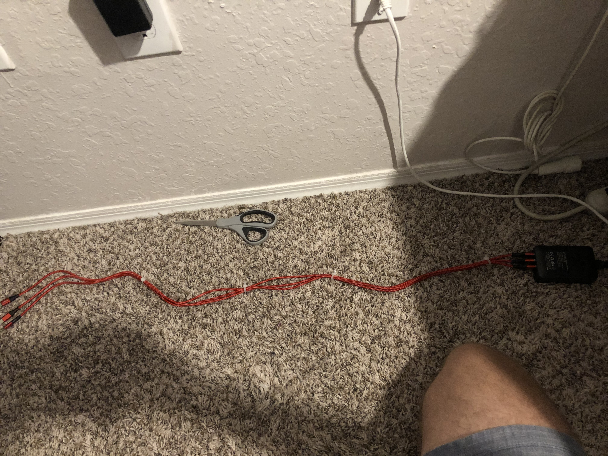

# raspberry-pi-4-spark-cluster
Project that details the creation of a Spark Cluster using Raspberry Pi 4 and Ubuntu Server LTS 20.04

## Introduction

## Physical Cluster Setup
#### 1. Server Rack

To start the setup, install your Raspberry Pis on the server rack casing. You can find these cases for cheap on Amazon.

<p float="left">
  
   
  
</p>

#### 2. Network Connection

For my setup, I used a wired ethernet connection from my router which was then routed to my Netgear 4-port 100 Mbps Switch. Then, I connected each Raspberry Pi to the switch via a 1-foot ethernet cable.

<p float="left">
  
   
  
</p>

#### 3. Power Supply

I used a  to power my Raspberry Pi. As they are Raspberry Pi 4s, they all use USB-C as a power supply.

<p float="left">
  
   
  
</p>

## Individual Raspberry Pi Setup

#### 1. Ubuntu Server LTS 20.04 Installation

Use the  to write the Ubuntu Server LTS 20.04 64 Bit to each pi.

<p float="left">
  
</p>

#### 2. Pi Configuration

SSH into each Pi individually and setup some basic configuration. Use this net-tools command to find the IP address of each Pi.

```bash
arp -na | grep -i "dc:a6:32"
```

If that doesn't work, you can also use your router admin interface to see a list of connected devices.

After you're connected you'll be prompted to change the password. Change it to the same password on each Pi; something secure but easy to remember. 

Ensure that each Pi has their time synchronized using the following command:

```bash
timedatectl status
```

You should be returned this prompt:

```
               Local time: Mon 2020-08-10 12:24:54 EDT  
           Universal time: Mon 2020-08-10 16:24:54 UTC  
                 RTC time: Mon 2020-08-10 16:24:54      
                Time zone: America/New_York (EDT, -0400)
System clock synchronized: yes                          
              NTP service: active                       
          RTC in local TZ: no          
```

If the system clock is synchronized and NTP service is active on each Pi, you're good to go. 

Lastly, run the following commands on each Pi to finish individual configuration:

```bash
sudo apt update
```

```bash
sudo apt upgrade
```

```bash
sudo reboot
```
## Cluster Setup

The following steps will need to be done on each Pi.

#### 1. Static IP Setup

Ubuntu Server LTS 20.04 requires Netplan for network configuration. Specifically, editing a few yaml files.

First, find the name of your network interface name by running:

```bash
ip a
```

The returned information should look like so:
<pre>
1: lo: <LOOPBACK,UP,LOWER_UP> mtu 65536 qdisc noqueue state UNKNOWN group default qlen 1000
    link/loopback 00:00:00:00:00:00 brd 00:00:00:00:00:00
    inet 127.0.0.1/8 scope host lo
       valid_lft forever preferred_lft forever
    inet6 ::1/128 scope host 
       valid_lft forever preferred_lft forever
2: <b>eth0</b>: <BROADCAST,MULTICAST,UP,LOWER_UP> mtu 1500 qdisc fq_codel state UP group default qlen 1000
    link/ether 7c:97:0d:a6:27:53 brd ff:ff:ff:ff:ff:ff
    inet 192.168.1.1/24 brd 192.168.0.255 scope global dynamic noprefixroute en
...
</pre>

The network interface name is the bolded `eth0` tag. We'll need this later.

Next, you'll need to use nano or vim to edit the configuration files. In this tutorial, I'll be using nano. Use the following commands to edit the configuration file to disable automatic network configuration.

```bash
sudo nano /etc/cloud/cloud.cfg.d/99-disable-config.cfg
```

All you need to add is the following code:

```cfg
network: {config: disabled}
```

Then, you'll setup the static IP by editing the 50-cloud-init.yaml file. Use the following command:

```bash
sudo nano /etc/netplan/50-cloud-init.yaml
```

My configuration file looked like so:
(X being the last digit of the specific IP address for each Pi; 10.1.2.121, 10.1.2.122, 10.1.2.123, etc.)

```yaml
network:
    ethernets:
        eth0:
            dhcp4: false
            addresses: [10.1.2.12X/24]
            gateway4: 10.1.2.1
            nameservers:
                addresses: [10.1.2.1, 8.8.8.8]
    version: 2
```

The basic template is:
```yaml
network:
    ethernets:
        {network interface name}:
            dhcp4: false
            addresses: [{Specifc IP Adress}/24]
            gateway4: {Gateway Address}
            nameservers:
                addresses: [{Gateway Address}, 8.8.8.8]
    version: 2
```

After edit the file, apply the settings by using the following commands:

```bash
sudo netplan try
```

```bash
sudo netplan apply
```

Then reboot the Pi and confirm the static IP address is set correctly.
## Hadoop Installation

## Spark Installation
